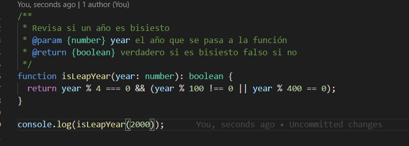
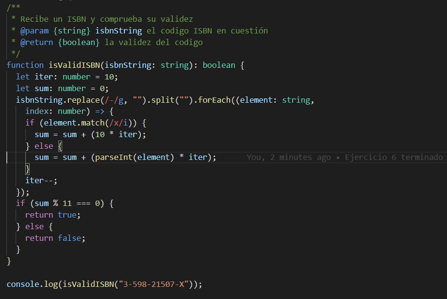

## Introducción

Práctica en donde se desarrollarán distintos problemas propuestos, o creados por el profesorado, o sacados de bancos de preguntas típicas de entrevistas de empleo a programadores, o sacados de problemas tipo de campamentos de código. 
La intencionalidad detrás de esta asignación es el desarrollo y práctica de las capacidades de los alumnos para resolver problemas y manejarse en un entorno TypeScript, en particular haciendo uso de las operaciones del tipo de dato __string__ y dando uso a los __tipos estáticos__.

## Objetivos

- Resolver los ejercicios propuestos.
- Mantenerse dentro del ámbito de las soluciones propuestas (no utilizar elementos del lenguaje todavia no impartidos en clase).
- Elaborar un informe que explique lo realizado.
- Documentar los ejercicios.
- Escribir pruebas (en este caso a posteriori, dado que se impartió la clase de pruebas después de tener acabados casi todos los ejercicios).

## Tareas previas

Para tener la formacion correcta para la cumplimentar los ejercicios propuestos, hacen falta dos pasos importantes:
- Completar los primeros 4 capítulos del libro [Essential Typescript: From Beginner to Pro](https://learning.oreilly.com/library/view/essential-typescript-from/9781484249796/html/Part_1.xhtml).
- Leerse y hacer algunas pruebas con los métodos del tipo __string__ descritos en el [tutorial de W3Schools](https://www.w3schools.com/js/js_string_methods.asp).
- Revisar el capítulo de expresiones regulares de [la misma fuente](https://www.w3schools.com/js/js_regexp.asp).
- Instalar TypeDoc
- Instalar Mocha y Chai

## Ejercicio 1 - Años bisiestos

En este ejercicio se escribio una funcion que devuelve si un año es bisiesto o no. Una cosa interesante durante el desarrollo de la misma fue que se consiguió otra solucion que no se basaba en operatoria matemática sino en utilizar el tipo __Date__ de JavaScript, inicializandola como 29 de febrero del año que nos concierna y confirmando despues de la inicialización si el valor del mes de dicha variable Date es 1. En ese caso, el año es bisiesto.

## Ejercicio 2 - Notación decimal y factorial

La clave de la operatoria se encuentra en la [página de Wikipedia en inglés](https://en.wikipedia.org/wiki/Factorial_number_system) de este sistema numérico, en donde se describe como hacer ambas transformaciones de manera sencilla.

## Ejercicio 3 - Validador de mensajes

Durante el desarollo de la práctica, los ejercicios de tipo validación de cadenas fueron los más complicados al que nos enfrentamos. Este, a pesar de su sencillez, tomó más tiempo del esperado. Una observacion curiosa es el uso de la función __exec__, que cuando casa con el patrón devuelve un array con los resultados de la casa, y en caso contrario devuelve __null__.

## Ejercicio 4 - Conversor de estilo

En este ejercicio lo más complejo fue que se saltara una iteracion después de casar con un caracter __'\_'__, si se hubiera realizado con un bucle tipo C/C++, seria simplemente un incremento en la variable índice. Ya que se trabajó con __forEach__, se tuvo que solucionar por otra vía.

## Ejercicio 5 - Un solo golpe

El más entretenido de los ejercicios, requiere entender que, teniendo en cuenta de que la mayoria de las funciones de string en JavaScript _no modifican_ el elemento, sino que devuelven uno nuevo, se pueden encadenar operaciones.

## Ejercicio 6 - Conversor ISBN

Las únicas cosas a tener en cuenta en este caso eran retirar los caracteres __'\-'__, reconocer la __x__.

## Ejercicio 7 - El siguiente número

El más complicado de los ejercicios, existen multiples posibles soluciones, en este se optó por un enfoque algorítmico sin hacer uso de las permutaciones. Empezando desde la derecha encontrar un numero mayor que el numero anterior. Despues revisaremos el subconjunto que queda a la derecha del numero encontrado previamente, conseguimos el menor de ese subconjunto, y cambiamos la posicion de ese minimo con la del numero encontrado previamente.

## Ejercicio 8 - Contando IPs

La complejidad de este ejercicio se trata en transformar la dirección IP en __number__.

## Ejercicio 9 - Entrenador Pokemon

Lo más importante fue que se realizó utilizando los tipados estáticos de TypeScript.

## Ejercicio 10 - Validador de nombre usuario

Desarrollamos una expresión regular en una línea que cumpliera con las restricciones planteadas en el enunciado.

## Conclusiones

Al terminar el trabajo, conseguimos desarrollar todos los ejercicios de manera correcta, cumplimentados todos con la documentacion y sus tests correspondientes, haciendo uso del scaffolding planteado en clase, utilizando linters, watchers de codigo, ramas en git, despliegue en GitHub Pages y uso del resto de herramientas sugeridas.

A nivel personal, lo mas complicado encontrado en la práctica fue la búsqueda de soluciones que no utilizaran material posterior, como clases u objetos de JavaScript. Aún así, el reto fue interesante.

## Bibliografía

TypeScript (s.f.). En _Wikipedia_. Recuperado el 23 de febrero de 2021 de https://es.wikipedia.org/wiki/TypeScript
