## Introducción

Esta asignacion se basra en realizar todo el trabajo previo para poder empezar a utilizar VSCode, un editor de texto flexible con potencial de entorno de desarrollo. Para ello, se revisará como instalarlo, que extensiones son las mas comunes, leer un pequeño tutorial sobre VSCode, configurarlo para conectarse por SSH a una máquina remota, en nuestro caso a la maquina virtual que configuramos en la práctica anterior, configurar las sesione colaborativas con Visual Studio Live Share, y, por último, sumergirnos levemente en el mundo de TypeScript, un superconjunto de JavaScript que añade tipos estáticos y objetos basados en clases, con un sencillo ejemplo.

## Objetivos

## Tareas previas

## Ejercicio 1 - Años bisiestos

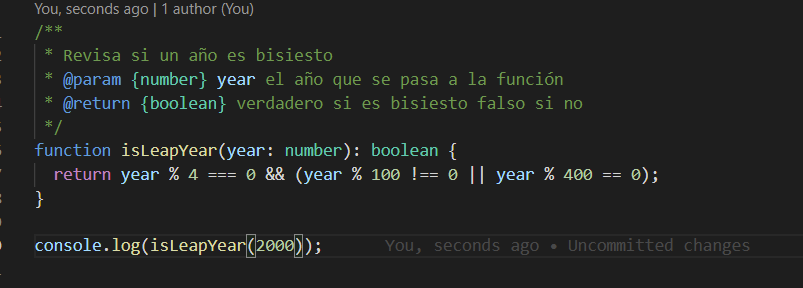

## Ejercicio 2 - Notación decimal y factorial

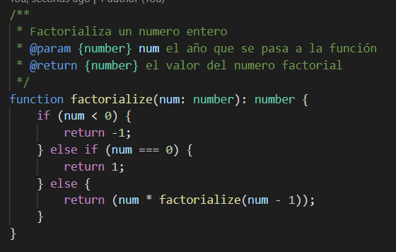
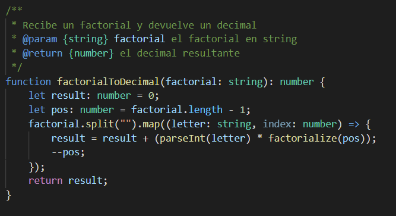
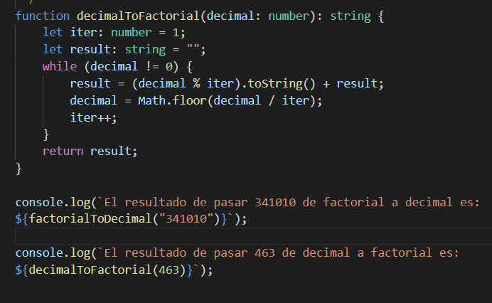

## Ejercicio 3 - Validador de mensajes

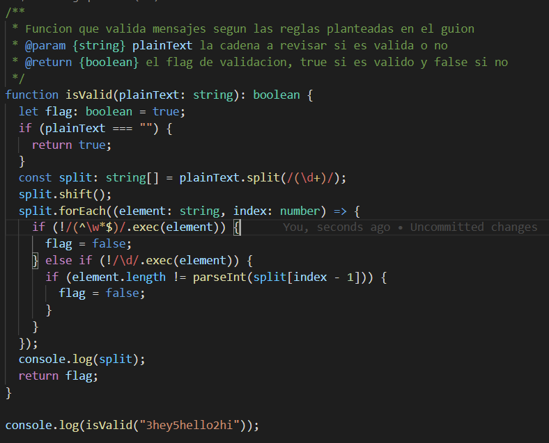

## Ejercicio 4 - Conversor de estilo

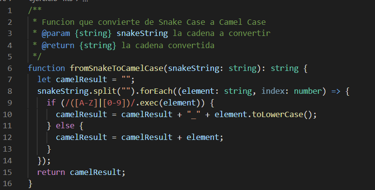
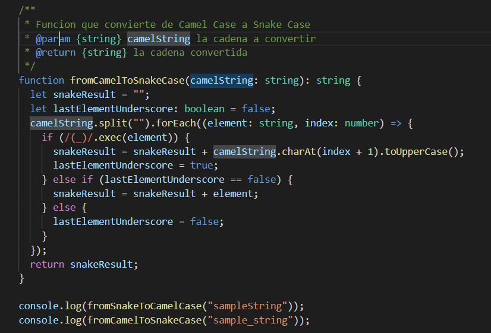

## Ejercicio 5 - Un solo golpe

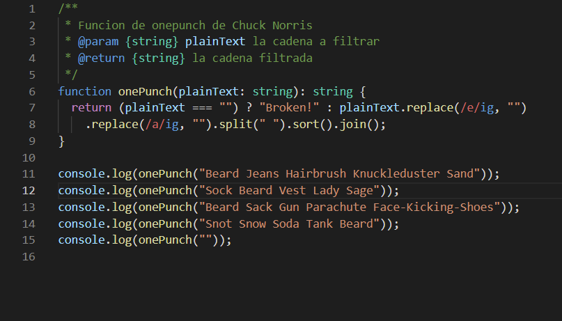

## Ejercicio 6 - Conversor ISBN

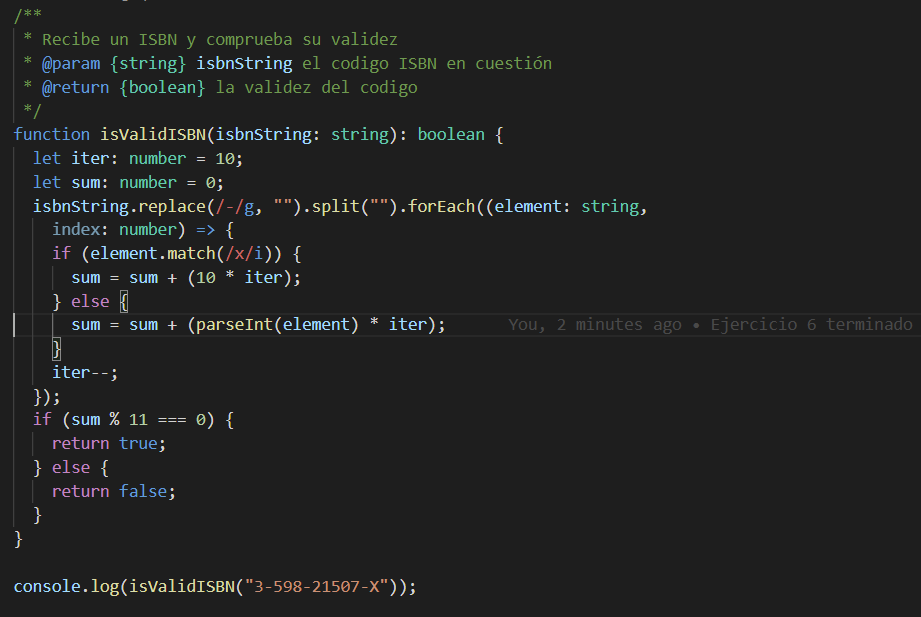

## Ejercicio 7 - El siguiente número

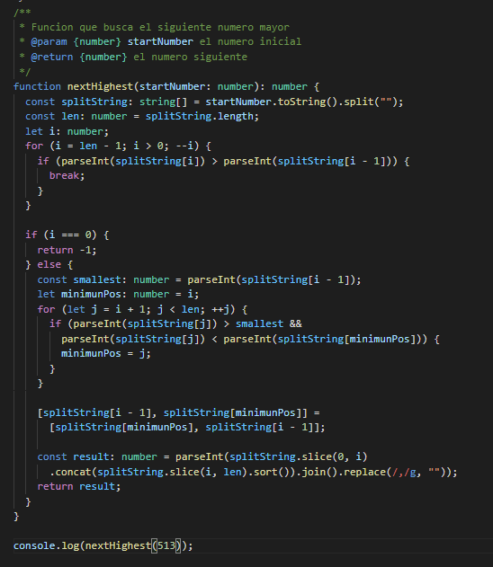

## Ejercicio 8 - Contando IPs

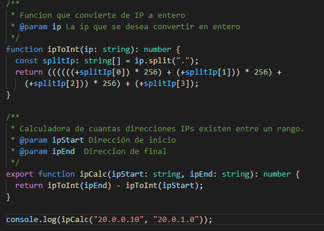

## Ejercicio 9 - Entrenador Pokemon

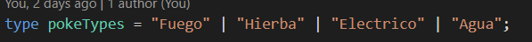

## Ejercicio 10 - Validador de nombre usuario

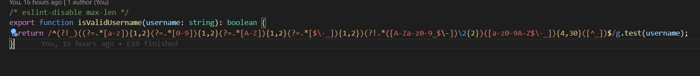

## Conclusiones

## Bibliografía

TypeScript (s.f.). En _Wikipedia_. Recuperado el 23 de febrero de 2021 de https://es.wikipedia.org/wiki/TypeScript
